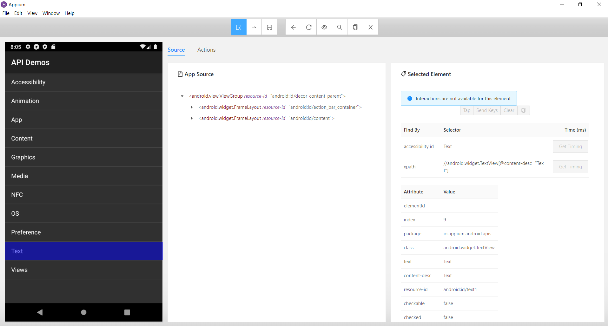

# LV 4 - Automated Testing of Mobile Applications (Android) - Appium

- Set ANDROID_HOME and JAVA_HOME user variables in environment variables, which are used to configure Appium
- Use an emulator with API 28
- After starting the server, it is necessary to describe the device specifications in JSON format (opens via 'New Session Window'):
```
{
  "app": "D:\\Faks\\Diplomski\\1.semestar\\MiTTPP\\ApiDemos-debug.apk",
  "VERSION": "9.0",
  "deviceName": "emulator",
  "platformName": "Android"
}
```
-> this enables elements inspection

<div align="center">
    </img>  
</div>

- Added Appium, TestNG and maven-surefire-plugin dependencies to POM.xml


